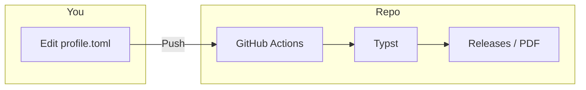

# Typst-Matrix

**[中文](README.md) | English**

[](#)
[](#)
[](https://github.com/bosprimigenious/Typst-Matrix/actions/workflows/build.yml)
[](#)

A declarative, data-driven typesetting framework built with Typst. Data-view separation for academic reports, business documents, and resumes; fork and edit data to get PDF.

---

## Before & After

**Note:** Examples and previews use real-world project data (e.g. full-stack projects, algorithm platforms) to demonstrate typesetting under complex content; no "Lorem Ipsum" placeholders.



| Before | After |
|--------|--------|
| Local LaTeX/Word setup, env errors, format tweaks | Fork → edit TOML → Push → download PDF from Releases |
| Reflow entire document when switching template | Data-view separation; switch template by changing entry file only |
| Inconsistent output across collaborators | Single data source + CI; output is deterministic |

---

## Zero-Setup PDF Generation

This repository is configured with a fully automated document pipeline. You do not need to install Typst locally.

| Step | Action |
|------|--------|
| 1 **Fork** | Click Fork in the top right to clone this repo to your account. |
| 2 **Permission** | Go to **Settings → Actions → General**, check **Read and write permissions** under Workflow permissions, save. |
| 3 **Edit Data** | Open [**data_center/profile.toml**](data_center/profile.toml), edit name, contact, education, etc., then **Commit changes**. |
| 4 **Download** | Wait 10–30 seconds, go to **Releases** on the right, download the PDF in **Latest Resume Build**. |

**Alternative:**

- **Artifacts:** In **Actions** → latest run → **Artifacts** you can also download the same PDFs.
- **Codespaces:** Click **Code → Create codespace on main** to open a browser-based VS Code with Typst + Tinymist pre-installed.

If you find this architecture helpful, a star would be appreciated.

---

## Gallery

CI automatically renders templates into preview images and writes them to `assets/`.

| Template | Description | Preview |
|----------|-------------|---------|
| [resume_aero_minimal.typ](03_resume/resume_aero_minimal.typ) | Aero single-column |  |
| [resume_golden_dual.typ](03_resume/resume_golden_dual.typ) | Golden dual-column |  |
| [cv_bento.typ](03_resume/cv_bento.typ) | Bento cards |  |
| [cv_cli.typ](03_resume/cv_cli.typ) | CLI terminal style |  |

More: [03_resume/README.md](03_resume/README.md).

---

## Features

- **Data-Driven:** Configure content via TOML/YAML; decouple style from data.
- **Zero-Setup CI/CD:** Cloud compilation and automatic release to Releases.
- **Bilingual Support:** Built-in language routing (`lang: "zh" | "en"`).
- **Modular Design System:** Unified color palette (Slate & Navy) and component library.

---

## Architecture

The project structure adopts a strict layered design.

```text
Typst-Matrix/
├── .github/workflows/      # CI/CD pipeline
├── 00_core_engine/         # Design system, fonts, macros
├── data_center/            # TOML data source
├── 03_resume/              # Resume templates
├── 02_cs_academics/        # Academic reports (e.g. BUPT)
└── 10_resume_and_portfolio/# Bilingual CV engine
```

---

## Getting Started

### Prerequisites

- Typst CLI >= 0.11.0
- (Optional) [just](https://github.com/casey/just) for task running
- (Optional) VS Code + Tinymist extension

### Installation

```bash
git clone https://github.com/bosprimigenious/Typst-Matrix.git
cd Typst-Matrix
```

### Configure Data Source

Edit [**data_center/profile.toml**](data_center/profile.toml): full comments inside; change `name`, `[contact]`, `[education]`, `[skills]` as needed.

### Compile Documents

**Method 1: Using just (Recommended)**

```bash
just dev          # Watch resume, live preview
just build        # Single file → output/resume.pdf
just build-all    # Multiple resume templates
just build-cv     # Bilingual ZH/EN resumes
just build-bupt   # BUPT lab report example
just fmt          # Format .typ with typstyle
just clean        # Remove output & gallery
```

**Method 2: Bare Commands**

Use `--root .` so cross-directory imports resolve:

```bash
typst compile --root . 03_resume/resume_aero_minimal.typ output/resume.pdf
typst watch --root . 03_resume/resume_aero_minimal.typ
```

**Method 3: Cloud (Fork, zero config)**

After editing `data_center` or `03_resume`, Push; GitHub Actions will compile and publish to **Releases** (tag: latest). Enable **Read and write permissions** in Settings → Actions → General on first use.

---

## Configuration

Visual specifications are managed in **00_core_engine/theme.typ** (Slate & Navy palette). Overwrite the `colors` dictionary to adjust the global theme.

---

## Contributing

Before submitting a Pull Request, please ensure:

- **No hard-coding:** Follow existing componentization principles.
- **Formatting:** Use `typstyle` to format modified `.typ` files.
- **Commit messages:** Follow [Conventional Commits](https://www.conventionalcommits.org/) (e.g. `feat:`, `fix:`, `docs:`).

---

## License

This project is licensed under the MIT License - see the [LICENSE](LICENSE) file for details.
