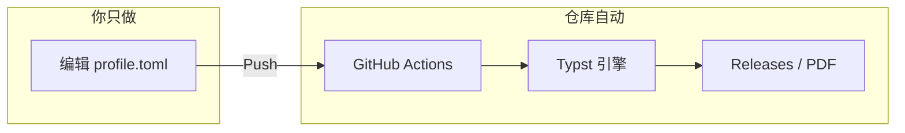

# Typst-Matrix

[](#)
[](#)
[](https://github.com/bosprimigenious/Typst-Matrix/actions/workflows/build.yml)
[](#)

Typst-Matrix is a declarative, data-driven typesetting framework built with Typst. 解决学术报告、商业文档与个人履历在多场景下的排版一致性，基于数据与视图分离，Fork 改数据即可出 PDF。

### 流水线架构（一图看懂）



**Before / After**

| Before | After |
|--------|--------|
| 本地装 LaTeX/Word，环境报错、格式反复调 | Fork → 改 TOML → Push，Releases 直接下 PDF |
| 简历/报告换模板要重排一整份文档 | 数据与视图分离，换模板只换入口文件 |
| 多人协作样式不统一 | 单一数据源 + CI 出图，输出一致 |

演示与示例中采用真实项目场景（如全栈项目、算法平台等）以展示复杂内容下的排版表现，非占位乱码。

---

## 零环境，一键生成简历 PDF

本仓库已配置**全自动文档流水线**：Fork 后改配置、Push，即可在 **Releases** 页直接下载排版好的 PDF，无需在本地安装 Typst。

| 步骤 | 操作 |
|------|------|
| 1 | 点击右上角 **Fork**，将本仓库克隆到你的账号下 |
| 2 | 进入 **Settings → Actions → General**，在 **Workflow permissions** 中勾选 **Read and write permissions**，保存（用于自动发布 PDF 到 Releases） |
| 3 | 打开 [**`data_center/profile.toml`**](data_center/profile.toml)，点击编辑，把 `name`、`contact`、`education` 等改成你的信息，**Commit changes** |
| 4 | 等待约 10–30 秒，打开你仓库右侧 **Releases**，在 **Latest Resume Build** 中下载生成的 PDF |

**只改一个文件：** 无需懂 Typst 语法，只要会填表。模板使用 03_resume 下的占位版；若需更细粒度控制，可直接改 03_resume 内对应 `.typ` 的占位文案。

**备选下载方式：** 在 **Actions** 页进入最新一次 run，在 **Artifacts** 中也可下载同批 PDF。

**在浏览器里改代码：** 点 **Code → Create codespace on main**，会打开已装好 Typst + Tinymist 的 VS Code 网页版，零配置开改。

若觉得这套架构对你有用，欢迎 Star 收藏，便于后续复用与二次开发。  
*If you find this architecture helpful, a star would be appreciated.*

---

## Gallery（模板预览）

CI 会自动把简历模板渲染成预览图并写入 `assets/`，以下为占位；首次 Push 后由 workflow 生成。

| 模板 | 说明 | 预览 |
|------|------|------|
| [resume_aero_minimal.typ](03_resume/resume_aero_minimal.typ) | Aero 极简单栏 |  |
| [resume_golden_dual.typ](03_resume/resume_golden_dual.typ) | 黄金比例双栏 |  |
| [cv_bento.typ](03_resume/cv_bento.typ) | Bento 卡片流 |  |
| [cv_cli.typ](03_resume/cv_cli.typ) | CLI 终端风 |  |

更多见 [03_resume/README.md](03_resume/README.md)。预览图由 CI 在 Push 后写回 `assets/`，首次可见于下一次 workflow 完成后。

---

**为什么选 Typst-Matrix**

- **Data-Driven**: 配置即内容，用 TOML/YAML 驱动渲染，样式与数据解耦。
- **Zero-Setup**: 云端编译并发布到 Releases，Fork 后改数据、Push 即可在 Releases 页下载 PDF。
- **Dev-Friendly**: 提供 `just` 任务脚本，本地 `just dev` 热重载、`just build` 出图；PR 建议经 `typstyle` 格式化。

## Features

- **Data-Driven Architecture**: 引入 MVC 模式思想，将个人信息、项目经历等底层数据下沉至 `01_data_center`，彻底解除内容与排版逻辑的耦合。
- **Bilingual Support**: 引擎层内置语言路由参数（`lang: "zh" | "en"`），支持中英双语的自动字体回退、断行算法切换及间距微调。
- **Modular Design System**: 构建了统一的全局色彩面板（Slate & Navy 体系）与组件库，确保多模态文档输出时的视觉一致性。
- **Zero-Setup CI/CD**: 集成 GitHub Actions 自动化构建管线。修改配置文件后 Push 代码，云端实例将自动完成依赖拉取、PDF 编译及 Release 发布。

## Architecture

项目结构采用严格的分层设计，以保障底层引擎的稳定性与上层工作区的灵活性：

```text
Typst-Matrix/
├── .github/workflows/      # 自动化编译与发版流水线
├── 00_core_engine/         # 核心引擎 (Design System, 字体映射, 全局宏指令)
├── 01_data_center/         # 数据源 (TOML 配置集)
├── 02_templates/           # 视图层 (单/双栏简历, 学术报告, 答辩幻灯片等模板)
└── 03_workspaces/          # 生产区 (执行文档实例)
```

## Getting Started

### Prerequisites

- Typst CLI >= 0.11.0
- （可选）[just](https://github.com/casey/just) 用于 `just dev` / `just build`
- （可选）VS Code + Tinymist 扩展

### Installation & Usage

Clone the repository:

```bash
git clone https://github.com/bosprimigenious/Typst-Matrix.git
cd Typst-Matrix
```

### Configure Data Source

编辑 **[`data_center/profile.toml`](data_center/profile.toml)**：文件内已有完整注释，按需改 `name`、`[contact]`、`[education]`、`[skills]` 等即可。部分模板会直接读该文件，其余在 03_resume 的 `.typ` 里改占位文案。

### Compile Document

**方式一：本地用 just（推荐）**

需安装 [just](https://github.com/casey/just)。在仓库根目录执行：

```bash
just dev                    # 监听 03_resume/resume_aero_minimal.typ，改即出图
just build                  # 单文件编译到 output/resume.pdf
just build-all              # 编译多个简历模板到 output/
just format                 # 使用 typstyle 格式化 .typ（PR 前建议执行）
```

**方式二：裸命令**

`--root .` 使 `00_core_engine` 等跨目录 import 生效：

```bash
typst compile --root . 03_resume/resume_aero_minimal.typ output/resume.pdf
typst watch --root . 03_resume/resume_aero_minimal.typ   # 热重载
```

**方式三：云端（Fork 后零配置）**

修改 `data_center` 或 `03_resume` 内占位后 Push，GitHub Actions 自动编译并发布到 **Releases**（tag: latest）；也可在 Actions 该 run 的 **Artifacts** 中下载 PDF。首次使用需在 Settings → Actions → General 中开启 **Read and write permissions**。

## Configuration

视觉规范由 `00_core_engine/theme.typ` 统一管理（Slate & Navy 色板）。覆写 `colors` 即可调整全局主题。

## Contributing

提交 Pull Request 前需满足：

- 遵循仓库现有的组件化拆分原则，避免在工作区写入硬编码（Hard-coding）。
- 使用统一的代码格式化工具（如 typstyle）处理修改过的 `.typ` 文件。
- Commit message 需遵循 Conventional Commits 规范（如 `feat:`, `fix:`, `docs:`）。

## License

This project is licensed under the MIT License - see the LICENSE file for details.
