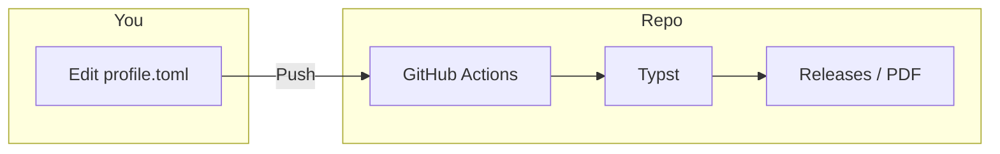

# Typst-Matrix

**English | [中文](README.zh-CN.md)**

[](#)
[](#)
[](https://github.com/bosprimigenious/Typst-Matrix/actions/workflows/build.yml)
[](#)

A declarative, data-driven typesetting framework built with Typst.  
基于数据与视图分离，解决学术报告、商业文档与个人履历在多场景下的排版一致性，Fork 改数据即可出 PDF。

---

## Before & After / 痛点对比

**Note:** The examples and previews in this repository use real-world project data (e.g., full-stack projects, algorithm platforms) to demonstrate typesetting performance under complex content; no "Lorem Ipsum" placeholders.  
**注：** 演示与示例采用真实项目场景（如全栈项目、算法平台等）以展示复杂内容下的排版表现，拒绝无意义占位符。



| Before | After |
|--------|--------|
| Local LaTeX/Word setup, env errors, format tweaks | Fork → edit TOML → Push → download PDF from Releases |
| Reflow entire document when switching template | Data-view separation; switch template by changing entry file only |
| Inconsistent output across collaborators | Single data source + CI; output is deterministic |

| Before（痛点） | After（本仓库） |
|----------------|-----------------|
| 本地装 LaTeX/Word，环境报错、格式反复调 | Fork → 改 TOML → Push，Releases 直接下 PDF |
| 简历/报告换模板要重排一整份文档 | 数据与视图分离，换模板只换入口文件 |
| 多人协作样式不统一 | 单一数据源 + CI 出图，输出一致 |

---

## Zero-Setup PDF Generation / 零环境一键出图

This repository is configured with a fully automated document pipeline. You do not need to install Typst locally.  
本仓库已配置全自动文档流水线，无需在本地安装 Typst。

| Step | Action |
|------|--------|
| 1 **Fork** | Click Fork in the top right to clone this repo to your account. / 点击右上角 Fork，将本仓库克隆到你的账号下。 |
| 2 **Permission** | Go to **Settings → Actions → General**, check **Read and write permissions** under Workflow permissions, save. / 进入 Settings → Actions → General，在 Workflow permissions 中勾选 Read and write permissions 并保存（用于允许自动发布 PDF 到 Releases）。 |
| 3 **Edit Data** | Open [**data_center/profile.toml**](data_center/profile.toml), edit name, contact, education, etc., then **Commit changes**. / 打开 data_center/profile.toml，编辑你的个人信息后提交。 |
| 4 **Download** | Wait 10–30 seconds, go to **Releases** on the right, download the PDF in **Latest Resume Build**. / 等待约 10–30 秒，在仓库右侧 Releases 中下载最新生成的 PDF。 |

**Alternative / 备选：**

- **Artifacts:** In **Actions** → latest run → **Artifacts** you can also download the same PDFs. / 在 Actions 页进入最新一次 run，在 Artifacts 中也可下载同批 PDF。
- **Codespaces:** Click **Code → Create codespace on main** to open a browser-based VS Code with Typst + Tinymist pre-installed. / 在浏览器里改代码：点 Code → Create codespace on main，会打开已装好环境的 VS Code 网页版。

*If you find this architecture helpful, a star would be appreciated.*  
*若觉得这套架构对你有用，欢迎 Star 收藏，便于后续复用与二次开发。*

---

## Gallery / 模板预览

CI automatically renders templates into preview images and writes them to `assets/`.  
CI 会自动把简历模板渲染成预览图并写入 `assets/`，首次 Push 后由 workflow 生成。

| Template | Description | Preview |
|-----------|-------------|---------|
| [resume_aero_minimal.typ](03_resume/resume_aero_minimal.typ) | Aero single-column / Aero 极简单栏 |  |
| [resume_golden_dual.typ](03_resume/resume_golden_dual.typ) | Golden dual-column / 黄金比例双栏 |  |
| [cv_bento.typ](03_resume/cv_bento.typ) | Bento cards / Bento 卡片流 |  |
| [cv_cli.typ](03_resume/cv_cli.typ) | CLI terminal style / CLI 终端风 |  |

More: [03_resume/README.md](03_resume/README.md). / 更多见 03_resume/README.md。

---

## Features / 核心特性

- **Data-Driven / 数据驱动:** Configure content via TOML/YAML; decouple style from data. / 配置即内容，用 TOML/YAML 驱动渲染，样式与数据解耦。
- **Zero-Setup CI/CD / 零配置流水线:** Cloud compilation and automatic release to Releases. / 云端编译并自动发布到 Releases。
- **Bilingual Support / 原生双语:** Built-in language routing (`lang: "zh" | "en"`). / 引擎层内置语言路由，支持中英字体回退与断行。
- **Modular Design System / 模块化设计:** Unified color palette (Slate & Navy) and component library. / 统一的全局色彩面板（Slate & Navy）与组件库。

---

## Architecture / 项目架构

The project structure adopts a strict layered design.  
项目结构采用严格的分层设计，以保障底层引擎的稳定性与上层工作区的灵活性。

```text
Typst-Matrix/
├── .github/workflows/      # CI/CD pipeline / 自动化编译与发版
├── 00_core_engine/         # Design system, fonts, macros / 核心引擎
├── data_center/            # TOML data source / 数据源
├── 03_resume/              # Resume templates / 简历模板
├── 02_cs_academics/        # Academic reports (e.g. BUPT) / 学术报告
└── 10_resume_and_portfolio/# Bilingual CV engine / 双语简历引擎
```

---

## Getting Started / 本地开发指南

### Prerequisites / 前置依赖

- Typst CLI >= 0.11.0
- (Optional) [just](https://github.com/casey/just) for task running / 用于执行任务脚本
- (Optional) VS Code + Tinymist extension / 推荐编辑器扩展

### Installation / 安装

```bash
git clone https://github.com/bosprimigenious/Typst-Matrix.git
cd Typst-Matrix
```

### Configure Data Source / 配置数据

Edit [**data_center/profile.toml**](data_center/profile.toml): full comments inside; change `name`, `[contact]`, `[education]`, `[skills]` as needed.  
编辑 data_center/profile.toml：文件内已有完整注释，按需改 name、[contact]、[education]、[skills] 等即可。

### Compile Documents / 编译文档

**Method 1: Using just (Recommended) / 方式一：使用 just 脚本**

```bash
just dev          # Watch resume, live preview / 监听简历，改即出图
just build        # Single file → output/resume.pdf
just build-all    # Multiple resume templates / 多简历模板
just build-cv     # Bilingual ZH/EN resumes / 中英双语简历
just build-bupt   # BUPT lab report example / 北邮实验报告示例
just fmt          # Format .typ with typstyle / 格式化（PR 前建议）
just clean        # Remove output & gallery / 清理构建产物
```

**Method 2: Bare Commands / 方式二：原生命令**

Use `--root .` so cross-directory imports resolve.  
必须使用 `--root .` 以确保跨目录引入生效：

```bash
typst compile --root . 03_resume/resume_aero_minimal.typ output/resume.pdf
typst watch --root . 03_resume/resume_aero_minimal.typ
```

**Method 3: Cloud (Fork, zero config) / 方式三：云端**

After editing `data_center` or `03_resume`, Push; GitHub Actions will compile and publish to **Releases** (tag: latest). Enable **Read and write permissions** in Settings → Actions → General on first use.  
修改 data_center 或 03_resume 后 Push，Actions 将编译并发布到 Releases；首次使用需在 Settings → Actions → General 中开启 Read and write permissions。

---

## Configuration / 统一配置

Visual specifications are managed in **00_core_engine/theme.typ** (Slate & Navy palette). Overwrite the `colors` dictionary to adjust the global theme.  
视觉规范由 00_core_engine/theme.typ 统一管理（默认 Slate & Navy 色板）。覆写 `colors` 即可调整全局主题。

---

## Contributing / 参与贡献

Before submitting a Pull Request, please ensure:  
提交 PR 前需满足以下规范：

- **No hard-coding:** Follow existing componentization principles. / 遵循组件化拆分原则，避免在工作区写入硬编码。
- **Formatting:** Use `typstyle` to format modified `.typ` files. / 使用 typstyle 处理修改过的 .typ 文件。
- **Commit messages:** Follow [Conventional Commits](https://www.conventionalcommits.org/) (e.g. `feat:`, `fix:`, `docs:`). / 遵循语义化提交规范。

---

## License

This project is licensed under the MIT License - see the [LICENSE](LICENSE) file for details.  
本项目采用 MIT 许可证，详见 [LICENSE](LICENSE)。
