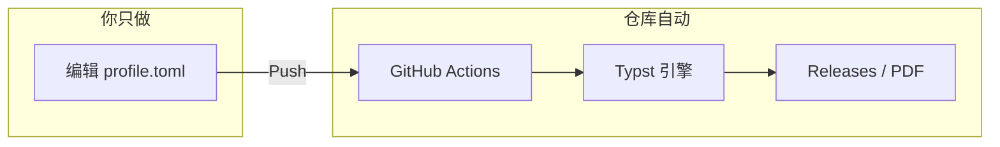

# Typst-Matrix

**中文 | [English](README.en.md)**

[](#)
[](#)
[](https://github.com/bosprimigenious/Typst-Matrix/actions/workflows/build.yml)
[](#)

基于 Typst 的声明式、数据驱动排版框架。解决学术报告、商业文档与个人履历在多场景下的排版一致性，数据与视图分离，Fork 改数据即可出 PDF。

---

## 痛点对比

**注：** 演示与示例采用真实项目场景（如全栈项目、算法平台等）以展示复杂内容下的排版表现，拒绝无意义占位符。



| 痛点 | 本仓库 |
|------|--------|
| 本地装 LaTeX/Word，环境报错、格式反复调 | Fork → 改 TOML → Push，Releases 直接下 PDF |
| 简历/报告换模板要重排一整份文档 | 数据与视图分离，换模板只换入口文件 |
| 多人协作样式不统一 | 单一数据源 + CI 出图，输出一致 |

---

## 零环境一键出图

本仓库已配置全自动文档流水线，无需在本地安装 Typst。

| 步骤 | 操作 |
|------|------|
| 1 **Fork** | 点击右上角 Fork，将本仓库克隆到你的账号下。 |
| 2 **权限** | 进入 **Settings → Actions → General**，在 **Workflow permissions** 中勾选 **Read and write permissions** 并保存（用于自动发布 PDF 到 Releases）。 |
| 3 **编辑数据** | 打开 [**data_center/profile.toml**](data_center/profile.toml)，编辑姓名、联系方式、教育背景等，**Commit changes**。 |
| 4 **下载** | 等待约 10–30 秒，在仓库右侧 **Releases** 中，于 **Latest Resume Build** 下载生成的 PDF。 |

**备选方式：**

- **Artifacts：** 在 **Actions** 页进入最新一次 run，在 **Artifacts** 中也可下载同批 PDF。
- **Codespaces：** 点 **Code → Create codespace on main**，在浏览器中打开已装好 Typst + Tinymist 的 VS Code 网页版。

若觉得这套架构对你有用，欢迎 Star 收藏，便于后续复用与二次开发。

---

## 模板预览

CI 会自动把简历模板渲染成预览图并写入 `assets/`，首次 Push 后由 workflow 生成。

| 模板 | 说明 | 预览 |
|------|------|------|
| [resume_aero_minimal.typ](03_resume/resume_aero_minimal.typ) | Aero 极简单栏 |  |
| [resume_golden_dual.typ](03_resume/resume_golden_dual.typ) | 黄金比例双栏 |  |
| [cv_bento.typ](03_resume/cv_bento.typ) | Bento 卡片流 |  |
| [cv_cli.typ](03_resume/cv_cli.typ) | CLI 终端风 |  |

更多见 [03_resume/README.md](03_resume/README.md)。

---

## 核心特性

- **数据驱动：** 配置即内容，用 TOML/YAML 驱动渲染，样式与数据解耦。
- **零配置流水线：** 云端编译并自动发布到 Releases。
- **原生双语：** 引擎层内置语言路由（`lang: "zh" | "en"`），支持中英字体回退与断行。
- **模块化设计：** 统一的全局色彩面板（Slate & Navy）与组件库。

---

## 项目架构

项目结构采用严格的分层设计，以保障底层引擎的稳定性与上层工作区的灵活性。

```text
Typst-Matrix/
├── .github/workflows/      # 自动化编译与发版
├── 00_core_engine/         # 核心引擎（Design System、字体、宏）
├── data_center/            # 数据源（TOML）
├── 03_resume/              # 简历模板
├── 02_cs_academics/        # 学术报告（如北邮实验报告）
└── 10_resume_and_portfolio/# 双语简历引擎
```

---

## 本地开发指南

### 前置依赖

- Typst CLI >= 0.11.0
- （可选）[just](https://github.com/casey/just) 用于任务脚本
- （可选）VS Code + Tinymist 扩展

### 安装

```bash
git clone https://github.com/bosprimigenious/Typst-Matrix.git
cd Typst-Matrix
```

### 配置数据

编辑 [**data_center/profile.toml**](data_center/profile.toml)：文件内已有完整注释，按需改 `name`、`[contact]`、`[education]`、`[skills]` 等即可。

### 编译文档

**方式一：使用 just（推荐）**

```bash
just dev          # 监听简历，改即出图
just build        # 单文件 → output/resume.pdf
just build-all    # 多简历模板
just build-cv     # 中英双语简历
just build-bupt   # 北邮实验报告示例
just fmt          # 使用 typstyle 格式化（PR 前建议）
just clean        # 清理构建产物
```

**方式二：原生命令**

必须使用 `--root .` 以确保跨目录引入生效：

```bash
typst compile --root . 03_resume/resume_aero_minimal.typ output/resume.pdf
typst watch --root . 03_resume/resume_aero_minimal.typ
```

**方式三：云端（Fork 零配置）**

修改 `data_center` 或 `03_resume` 后 Push，GitHub Actions 将编译并发布到 **Releases**（tag: latest）。首次使用需在 **Settings → Actions → General** 中开启 **Read and write permissions**。

---

## 统一配置

视觉规范由 **00_core_engine/theme.typ** 统一管理（默认 Slate & Navy 色板）。覆写 `colors` 即可调整全局主题。

---

## 参与贡献

提交 PR 前需满足以下规范：

- **无硬编码：** 遵循组件化拆分原则，避免在工作区写入硬编码。
- **格式化：** 使用 typstyle 处理修改过的 `.typ` 文件。
- **提交信息：** 遵循 [Conventional Commits](https://www.conventionalcommits.org/)（如 `feat:`、`fix:`、`docs:`）。

---

## License

本项目采用 MIT 许可证，详见 [LICENSE](LICENSE)。
